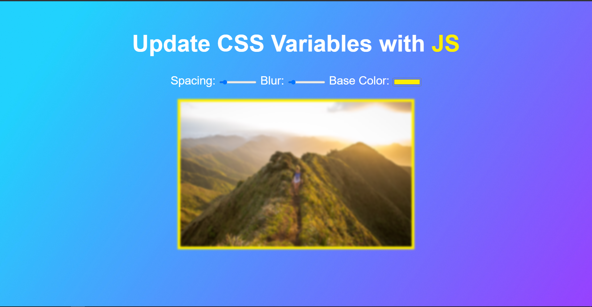

# Change-the-View
Simple web app to change the spacing, blur strength and color of background of the image using the slider

## Table of contents

- [Overview](#overview)
  - [Screenshot](#screenshot)
  - [Links](#links)
- [My process](#my-process)
  - [Built with](#built-with)
- [Author](#author)

## Overview

### Screenshot
Here is the result!

### Links

- Live Site URL: (https://ashu305.github.io/Beats-With-keys/)

## My process

### Built with

- Semantic HTML5 markup
- CSS custom properties
- Java Script

## Author

- Github - [ashu305](https://github.com/ashu305)

